# stm32-quectel-eg915-driver

This firmware enables an STM32G0B0RE microcontroller to manage a Quectel EG915U-LA modem. The primary function is to establish a connection to an MQTT broker for bidirectional communication, facilitating several key tasks for a connected Control Board.

### Project Description

**Firmware Version:** 1.0.0

The module is designed to perform three core functions:
1.  **Data Reporting:** Transmit operational statistics to a Firebase server.
2.  **Content Management:** Download barcode (EAN) data from a server and transfer it to the Control Board.
3.  **Remote Updates (FOTA):** Perform Firmware-Over-The-Air (FOTA) updates on the connected Control Board.

### Hardware Configuration
*   **Microcontroller:** STM32G0B0RET6
*   **Cellular Modem:** QUECTEL EG915U-LA
*   **SIM:** 1nce SIM card with a static IP address

### Development Environment
*   **IDE:** STM32CubeIDE (v1.18.0)
*   **Framework:** STM32CubeG0 Firmware Package (v1.6.2)
*   **Compiler:** arm-none-eabi-gcc
*   **Target MCU:** STM32G0B0RETx

# Project Summary: commQuectelv00

## 1. Project Overview & Core Mission
The **commQuectelv00** project is a high-reliability **Embedded Communication Gateway** developed for the STM32G0B0RE platform. Its primary function is to manage a Quectel Cellular Module (supporting LTE/GSM) to provide cloud connectivity (via MQTT) to a local host controller (referred to as the Control Board).

The system acts as an intelligent bridge, abstracting the complexities of cellular network registration, socket management, and the MQTT protocol into a simplified interface for the local hardware.

---

## 2. Technical Architecture & Implementation
The software is organized into a clean, **Layered Architecture** that separates low-level hardware control from high-level application logic:

*   **Application Layer (`module_app_sim.c`):** Orchestrates the device lifecycle, including the initial boot sequence, MQTT session persistence, and the routing of telemetry data.
*   **Driver Layer (`module_sim.c` / `atc.c`):** Implements a robust **AT Command Engine**. It manages asynchronous responses from the cellular module, parses Unsolicited Result Codes (URCs), and handles network-specific errors (CME Errors).
*   **Hardware Layer (STM32 HAL):** Utilizes standard STM32 peripherals (UART, DMA, GPIO, Timers) to interface with the physical hardware.

---

## 3. Key Engineering Features

### **Deterministic Task Scheduling**
The project implements a **Cyclic Executive Scheduler** (`cyclic_executive_sch.c`). This non-preemptive model manages multiple tasks (such as RSSI monitoring, payload processing, and statistics transmission) at fixed millisecond intervals, ensuring predictable system behavior without the overhead of an RTOS.

### **Resilient Data Handling**
*   **Non-Blocking I/O:** The system uses **UART with DMA and Idle Line Detection** to receive variable-length messages from the cellular module without stalling the CPU.
*   **Buffer Management:** Multiple **Circular Buffers** are employed to prevent data loss. For instance, if a network drop occurs, telemetry statistics are stored in a "Remains Buffer" and re-transmitted automatically once the connection is restored.

### **Fault Tolerance & Reliability**
The firmware is designed for unattended operation in the field:
- **Automatic Reconnection:** Implements a multi-tiered strategy to recover from MQTT or network drops.
- **Hardware Recovery:** Includes logic to hard-reset the cellular module or the entire MCU via the `Error_Handler` if a critical, unrecoverable state is detected.

---

## 4. Technical Skills Demonstrated
This project showcases expertise in several core embedded engineering domains:

-   **Embedded C:** Advanced use of structures, pointers for task management, and volatile variables for interrupt safety.
-   **STM32 Peripherals:** Expertise in UART (DMA/IT), Timers, and GPIO control.
-   **Cellular Connectivity:** Mastery of Quectel AT commands for TCP/IP and MQTT stacks.
-   **IoT Protocols:** Implementation of **MQTT** features including Publish/Subscribe, Quality of Service (QoS) management, and Last Will and Testament (LWT) messages.
-   **System Design:** Experience in building state machines for complex boot sequences and network-aware applications.

---

## 5. Professional Impact
> "This project demonstrates a disciplined approach to embedded systems design, prioritizing **determinism** and **data integrity**. By combining a custom scheduler with advanced DMA buffering, I have created a gateway capable of maintaining reliable cloud communication in challenging network environments."

---

## 1. Flow Chart: System Initialization and Main Loop

The following flow chart describes the start-up sequence and the cyclic execution model of the firmware.

### OPEN IMAGE: [diagrams-flow_chart](https://github.com/fhernando-m5/stm32-quectel-eg915-driver/blob/main/imgs/diagrams-flow_chart.svg?raw=1)


### Flow Chart Explanation
- **Initialization Phase**: The system starts by configuring the hardware (HAL, Clocks, UARTs). It then initializes a cyclic scheduler with four main tasks. The SIM module undergoes a rigorous initialization sequence (AT commands) to ensure LTE connectivity and MQTT broker connection.
- **Main Loop**: The firmware enters an infinite loop where the scheduler is called continuously. The scheduler checks the elapsed time for each task and executes them if their period has reached.
- **Cyclic Tasks**:
    - **Task 1 (5ms)**: Checks for incoming MQTT messages from the SIM module and forwards them to the Control Board.
    - **Task 2 (1min)**: Monitors the signal strength (RSSI) to ensure a stable connection.
    - **Task 3 (6ms)**: Captures data from the Control Board and publishes it to the MQTT broker.
    - **Task 4 (7min)**: Flushes any pending statistics stored in internal circular buffers.

---

## 2. Sequence Diagram: System Interactions

The following sequence diagram illustrates the communication flow between the four main entities of the system.

### OPEN IMAGE: [diagrams-sequence](https://github.com/fhernando-m5/stm32-quectel-eg915-driver/blob/main/imgs/diagrams-sequence.svg?raw=1)


### Sequence Diagram Explanation
- **Startup**: The MCU triggers the SIM module and waits for the `RDY` status.
- **Handshake**: A series of AT commands are exchanged to configure the network and MQTT parameters. The phase ends when the MCU successfully connects to the broker and sends a `READY` message.
- **Uplink (Green)**: When the Control Board sends data to the MCU, it is buffered and then sent to the SIM module using the `AT+QMTPUBEX` command. The SIM module handles the MQTT protocol details to publish the data to the broker.
- **Downlink (Blue)**: Incoming MQTT messages arrive at the SIM module as Unsolicited Result Codes (URCs) starting with `+QMTRECV`. The MCU parses these and immediately forwards the payload to the Control Board.
- **Maintenance (Yellow)**: The MCU periodically polls the SIM module for signal strength (`+CSQ`) and connection status to handle potential reconnections automatically.

---

# How to Build the Project

Follow these steps to set up the development environment and open the project in STM32CubeIDE.

### Prerequisites
1.  **Install STM32CubeIDE:** Download and install the latest version of [STM32CubeIDE](https://www.st.com/en/development-tools/stm32cubeide.html) for your operating system.
2.  **Install the STM32G0 HAL:** The project requires the STM32CubeG0 firmware package. It should be installed automatically through the IDE's package manager. If not, you can download it manually from the [STM32CubeG0 page](https://www.st.com/en/embedded-software/stm32cubeg0.html) and install it via `Help > Embedded Software Packages` in the IDE.

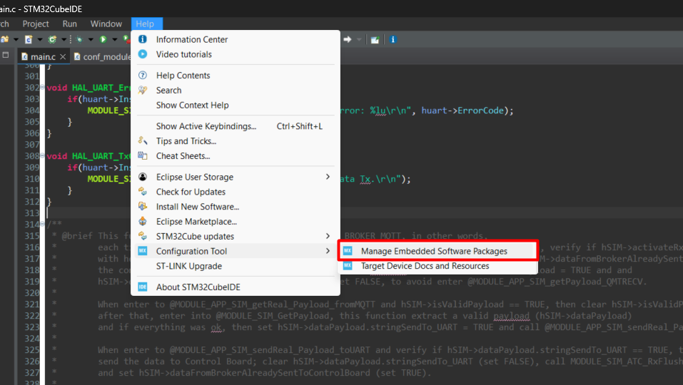

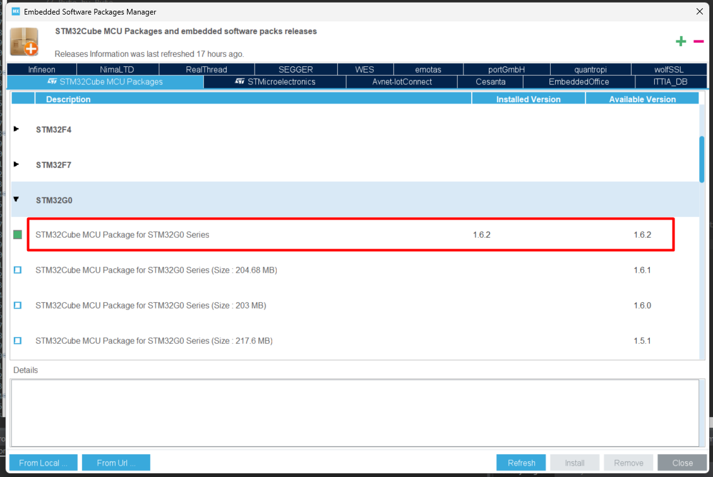

3.  **Clone the Repository:** Get the source code by cloning the repository to your local machine using Git:
    ```bash
    git clone https://github.com/ChillitJSMR/CHILLIT_SIM.git
    ```
    *Alternatively, you can use a GUI client like [Sourcetree](https://www.sourcetreeapp.com).*

### Importing the Project
1.  **Launch STM32CubeIDE** and select the workspace located at `.../CHILLIT_SIM/_STM32G0B0RE/_workspaceSTM32` within the cloned repository.

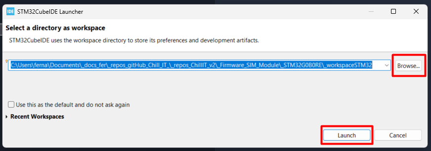    

2.  Go to `File > Import...`.

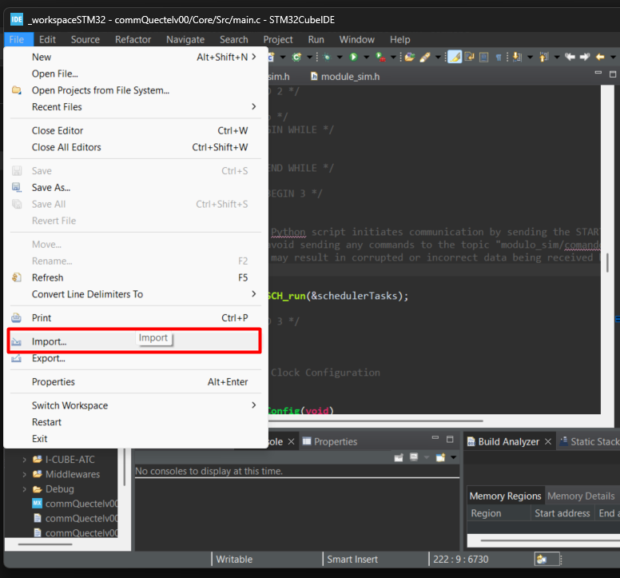

3.  In the import dialog, expand `General`, select `Existing Projects into Workspace`, and click `Next`.

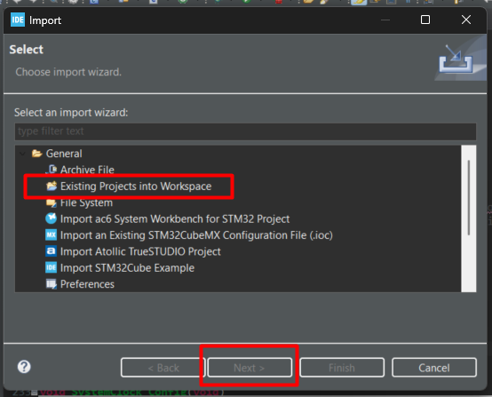

4.  Configure the import:
    *   **Select root directory:** Browse to the root directory (_workspaceSTM32) of the cloned repository (the folder containing the `Core/`, `Drivers/`, etc. folders).
    *   **Projects:** Select `commQuectelv00`.
    *   Click **Finish**.

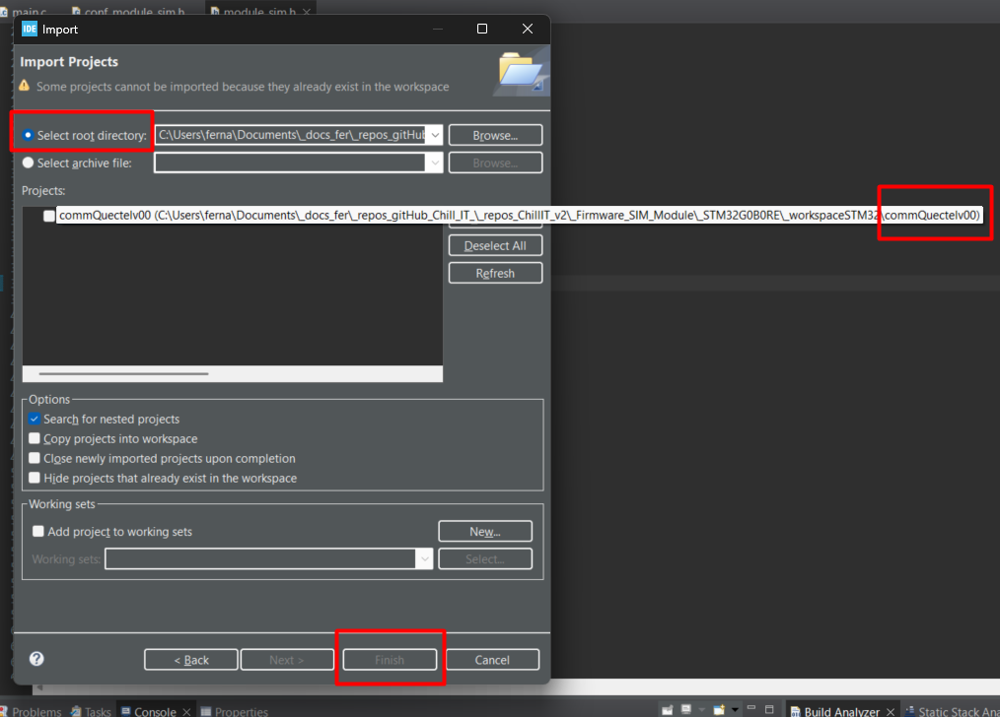

5.  The project will now be imported and appear in the Project Explorer. You can build it (`Debug Mode default`) by right-clicking on the project and selecting `Build Project`.

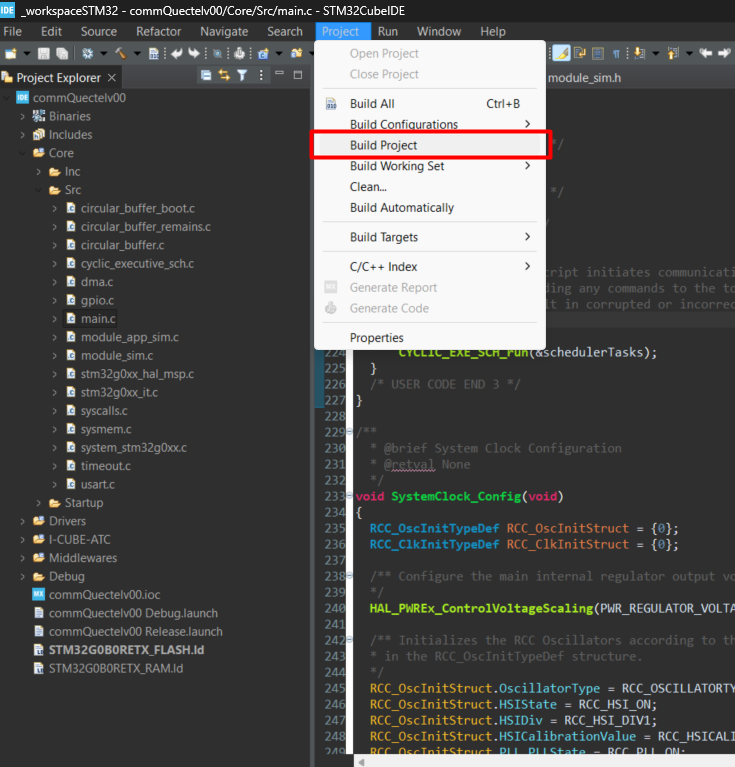

### Compiling and Flashing the Project (Release Mode)

This section describes how to build the project for Release and flash it to the target microcontroller.

#### 1. Set the Build Configuration
*   Go to `Project > Build Configurations > Set Active > Release`.
*   This tells the IDE to build with optimizations and without debug symbols.

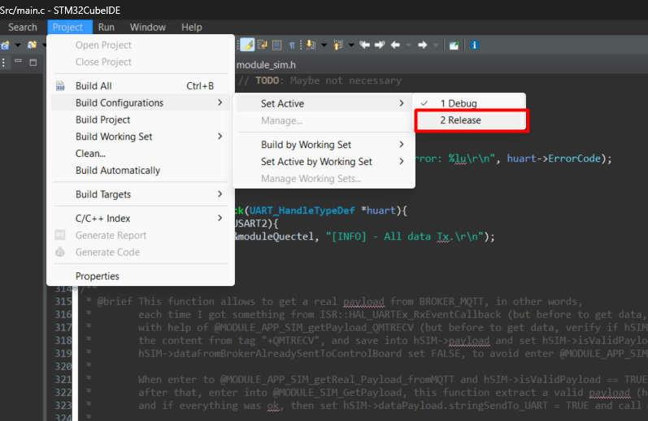

#### 2. Build the Project
*   Right-click on the `commQuectelv00` project in the Project Explorer.
*   Select `Build Project`. The IDE will compile the code and generate the binary files.

#### 3. Locate the Binary File
*   After a successful build, the generated `.elf` file can be found in the `Release/` folder within your project directory.

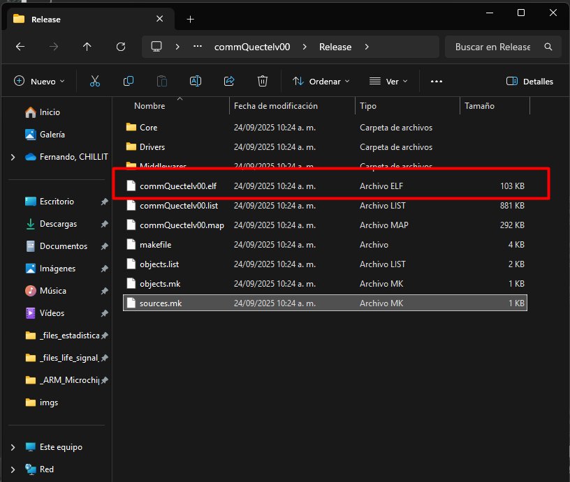

#### 4. Flash the Firmware to the MCU
*   Ensure the **ST-LINK programmer is connected** to the SIM Module board and your computer.
*   Go to `Run > Run As > 1 STM32 C/C++ Application`.

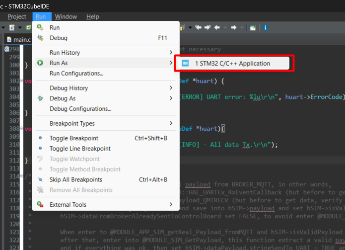

*   A configuration dialog will appear. Verify the following settings:
    *   **C/C++ Application:** Browse and select the `commQuectelv00.elf` file from the `Release/` folder.
    *   **Build Configuration:** `Release`
*   Click `OK` to begin the flashing process.

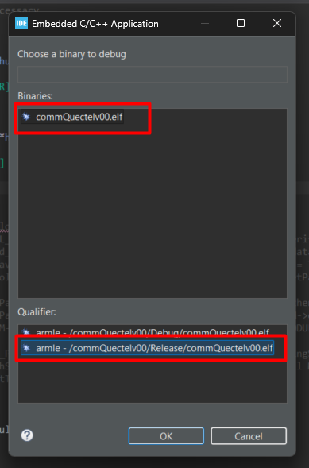

*   The console will output the flashing progress. A successful flash will be confirmed by a message in the console.

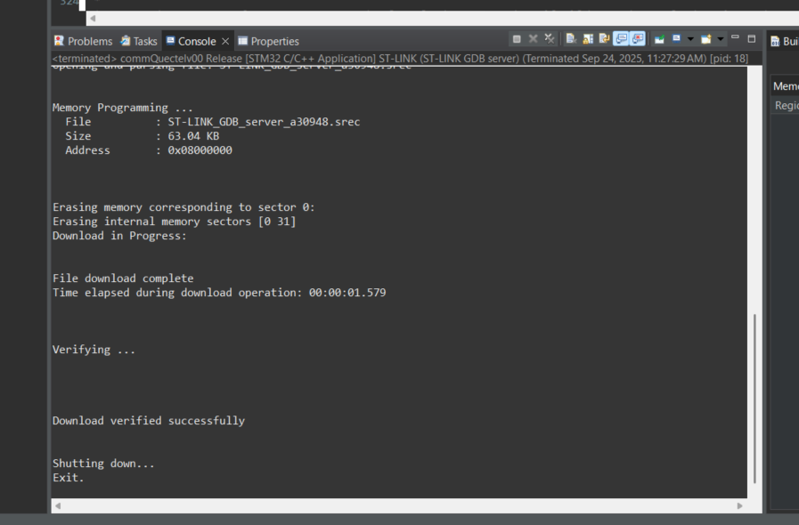

### Flashing the Firmware using STM32CubeProgrammer

This section explains how to flash the compiled firmware (ELF file) to the target microcontroller using the standalone STM32CubeProgrammer tool.

#### 1. Download and Install the Tool
*   Download **STM32CubeProgrammer** for your operating system from the official STMicroelectronics website:
    *   [STM32CubeProgrammer Download Page](https://www.st.com/en/development-tools/stm32cubeprog.html)
*   Install the application and launch it.

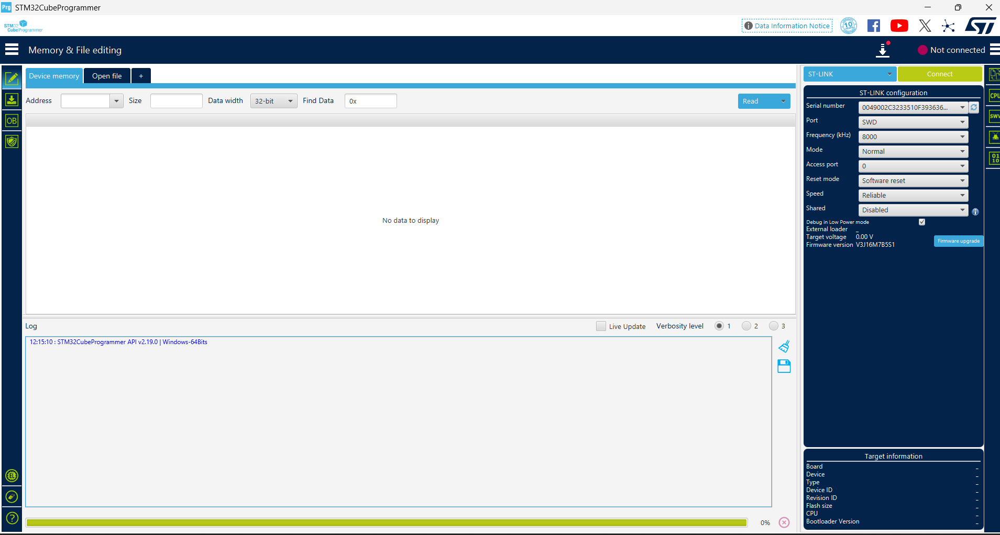

#### 2. Connect and Program the MCU
1.  **Select the ELF File:**
    *   In the main interface, navigate to the **Erasing and Programming** section.
    *   Click the `Browse` button next to "File path" and select the `.elf` file from the `Release_Firmware_1_7_1` folder in the project repository.

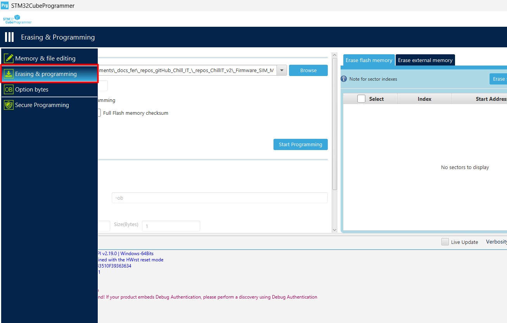

2.  **Establish Connection:**
    *   Ensure the **ST-LINK debugger is properly connected** to both the SIM Module board and your computer.
    *   Click the `Connect` button. The tool should establish a connection with the microcontroller.

3.  **Erase the Memory:**
    *   Click `Full chip erase` to clear the microcontroller's flash memory. Wait for the operation to complete.

4.  **Program the Firmware:**
    *   Click `Start Programming` to flash the new firmware.
    *   Monitor the log window for progress. A message confirming successful programming will appear upon completion.

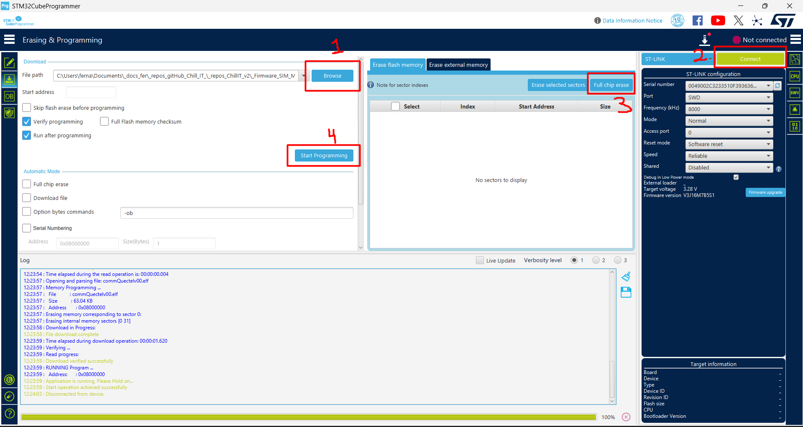

---
